# **Módulo "Lista de Videojuegos"**

## Descripción:

Este módulo se encarga de listar videojuegos, mostrando información relevante sobre ellos.
También gestiona reservas(solo las crea y las cierra, con pequeñas validaciones).

*Para facilitar la comprensión y la corrección, he implementado datos para el modo demo, son prácticamente los mismos datos que se muestran en las capturas.*

Implementa vistas kanban, calendar y las estandar(tree y form)

Esta basado en la práctica de la biblioteca, gran parte de las clases son de la misma, pero modificadas para encajar en el concepto de publicación de videojuegos. Pero el módulo se creó con la herramienta que ofrece odoo.

*Está programado y probado en odoo 12.0*

***

## Elementos visuales:

**Modulo en la lista de aplicaciones:**

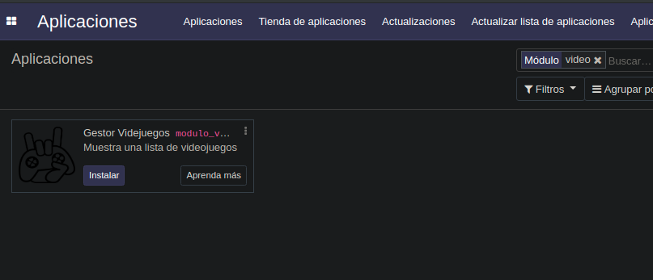

**Lista videojuegos vista Kanban:**

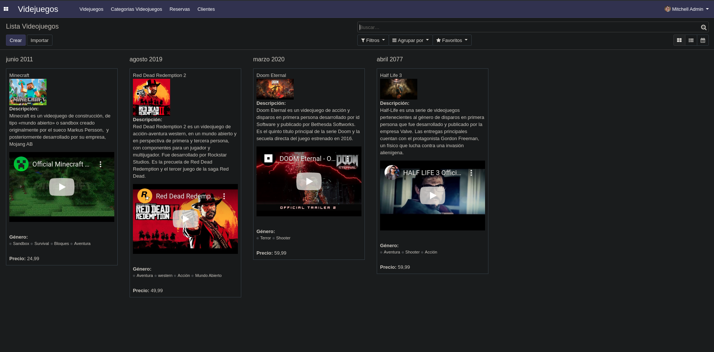

En esta vista, los videojuegos se ordenan por fecha de lanzamiento.
Se muestra su título, la carátula, una descripción, luego un video del trailer(se puede cambiar por o añadir más elementos html si se desea), los géneros a los que pertenece y su precio.

**Lista videojuegos vista Tree:**

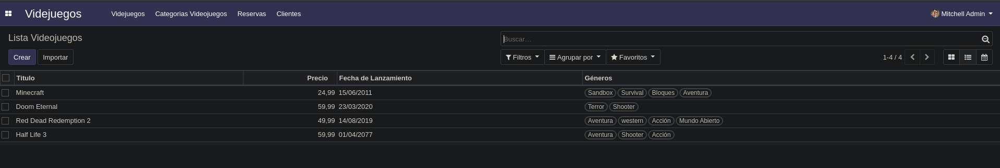

**Lista videojuegos vista Calendar:**

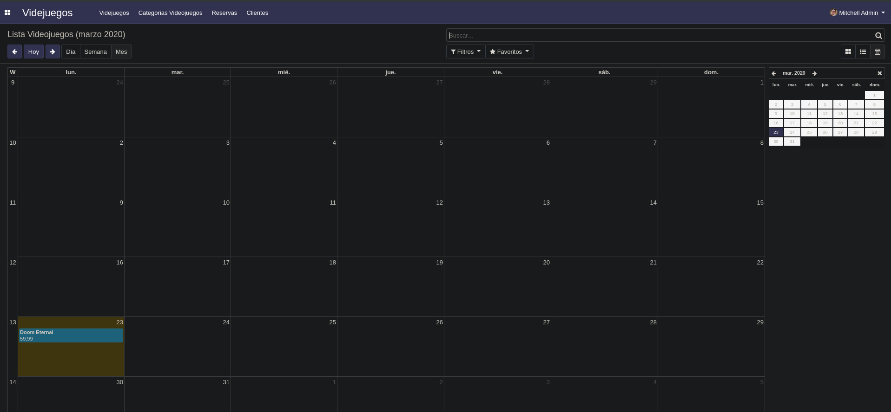

Se muestran los videojuegos según el més en el que salen.

**Lista videojuegos vista Form:**

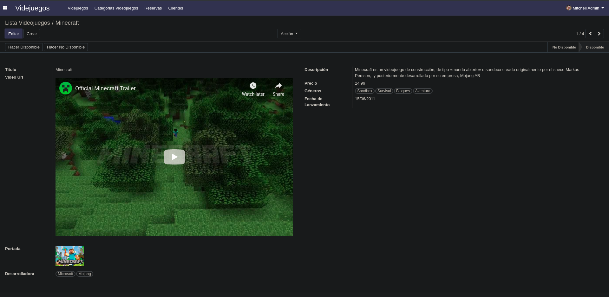

Este es el formulario para crear un videojuego. La fecha de lanzamiento por defecto es el día actual, su estado siempre es de no disponible y el precio por dececto es de 59,99 (suele ser lo normal cuando sale un videojuego).Cuando se termine de añadir el videojuego, se tiene que clicar en el boton "Hacer Disponible", para que este pueda ser reservado por los clientes.

En caso contrario salta este mensaje:
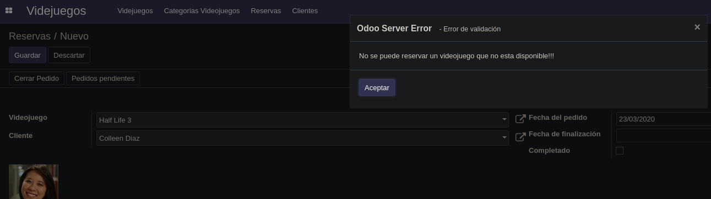

**Categorias(Géneros) vista Tree:**

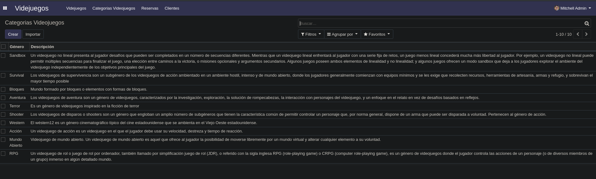

**Categorias(Géneros) vista Form:**

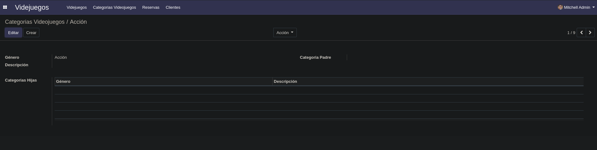

Esta clase es la misma de Categorias de la biblioteca, pero con los nombres de los campos en español, puesto que no necesita ningún cambio para esta implementación.

**Reservas vista Tree:**

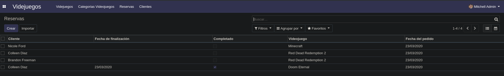

**Reservas vista Calendar:**

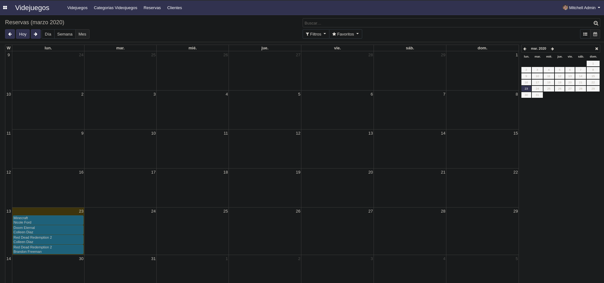

**Reservas vista Form:**

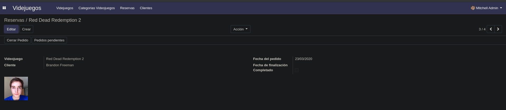

La fecha de finalización y el valor completado, se generan pulsando el botón "cerrar pedido", establece el campo completado a *True* y establece como fecha de finalización la actual.

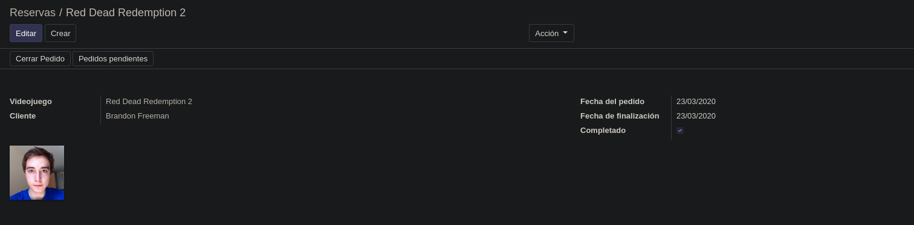

Si ya estaba finalizado sale este mensaje:

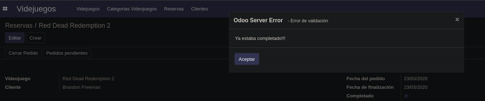

Si se pulsa en el botón de pedidos pendientes, muestra el número de pedidos sin completar del cliente actual y el precio total de sus reservas.

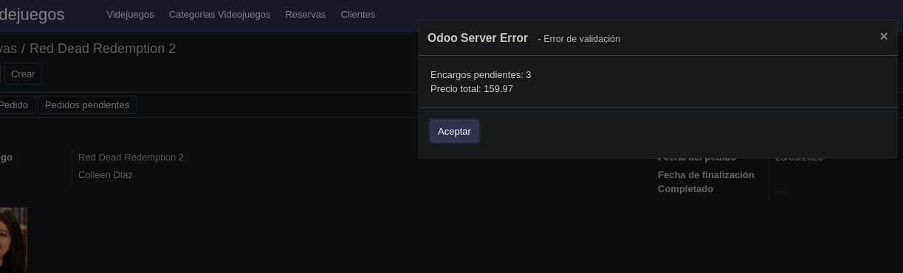

También se puede hacer una reserva pulsando en el botón "Reservar" cuando se selecciona un juego.

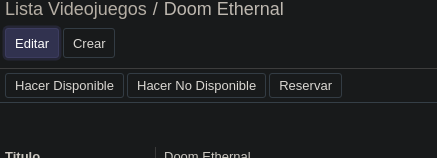

Lo que hace es crear una reserva con el usuario actual y el juego seleccionado.
Si el usuario no está dado de alta como cliente, aparece el siguienete mensaje:

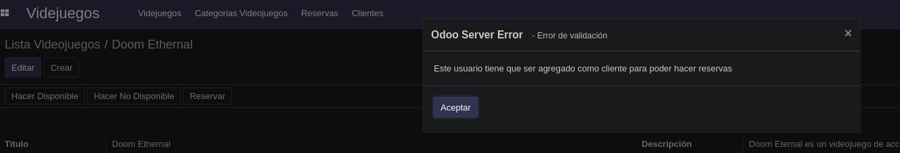

Añadimos el usuario actual como cliente:

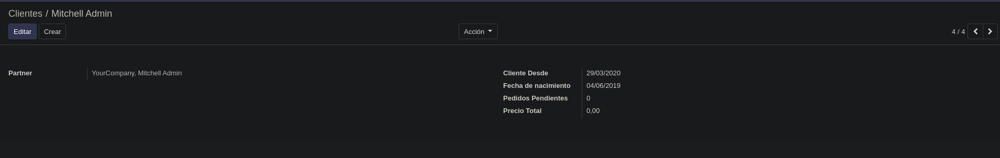

Le damos al botón y se crea el siguiente registro:

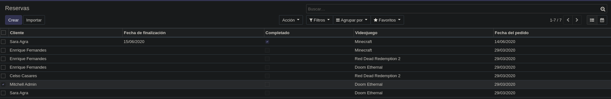

**Clientes vista Tree:**

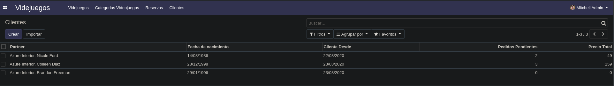

*(El campo Pedidos Pendientes y el de Precio Total, es un campo calculado y hace lo mismo que el boton de arriba)*

---

***Autor: Manuel Ángel Mazás De Jesús***
